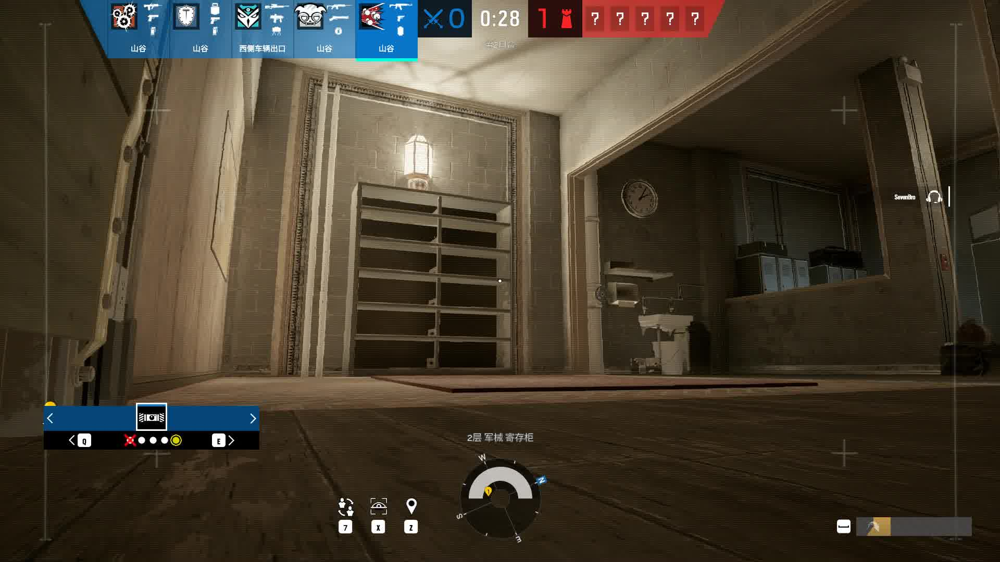
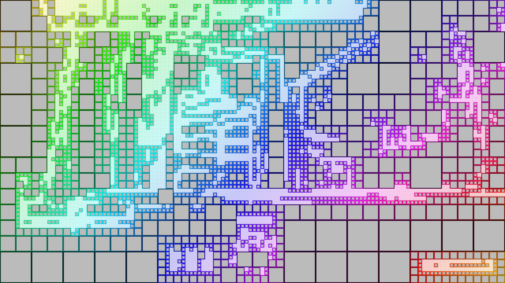

## 0.1.1

(A10511)

- 大大优化了一般情况下的内存占用。buffer的默认长度：对于单图片，仍然是8K（7680×4320）；对于批处理，现在默认是1K（1920×1080）。
- 新增了参数：`--fps`，用来决定动画的速度（对于以下两个笔刷就是彩虹波动的速度）。
- **把那两个逆天笔刷给放出来了，`yr-add`和`yr-mul`：**

    <table style="table-layout:fixed;width:100%;"><tr>
        <th>Original</th>
        <th><code>--shape yr-add --thres-ay 10 --depth 5 --bg-color BBB --stroke-width 6</code></th>
        <th><code>--shape yr-mul --thres-ay 10 --depth 6</code></th>
    </tr><tr>
        <td></td>
        <td></td>
        <td></td>
    </tr><tr>
        <td>(N/A)</td>
        <td>Demo video: <a target="_blank" href="https://www.bilibili.com/video/BV1SM4y1b7Ww/">BV1SM4y1b7Ww</a></td>
        <td>Demo video: <a target="_blank" href="https://www.bilibili.com/video/BV1SM41137VF/">BV1SM41137VF</a></td>
    </tr></table>

    （“Yr”取“云南”和“彩虹”之意；而`add`和`mul`则是结点坐标到色相的算术方法）

## 0.1.0

(A10506)

    /* field omitted */
