# Quadim

[](https://crates.io/crates/quadim)
[](https://crates.io/crates/quadim)
[](#)
[](https://docs.rs/quadim)
[](https://github.com/eternal-io/quadim)

Fastest image quadtree stylization implementation to date, capable of hundreds of fps and avoiding ugly non-squares.

[简体中文](./README.zh-Hans.md)

> **喜讯：0.1.1“云南菌子”笔刷已发布！详见[CHANGELOG](./CHANGELOG.zh-Hans.md)。**
>
> *但可惜，我已经没有时间将Quadim集成到OBS里了。这个任务就交给你们了！*

## Installation: Run **`cargo install quadim -F build-bin`**

*(Sorry I can't provide binaries)*

## Usage & Gallery

0. Don't worry about messing your workspace. *(Thanks to my another project [src-dst-clarifier](https:github.com/eternal-io/src-dst-clarifier))*

    ``` shell
    > quadim example.jpg    # A file named like "example.jpg-A01123-0456-0789.png" will generate.

    > quadim ./frames       # A directory named like "frame-A01123-0456-0789" will generate.
    ```

1. No! I am too lazy to write a tutorial, try it yourself please ╰(￣ω￣ｏ)

    ```
    Fastest image quadtree stylization implementation to date, capable of hundreds of fps and avoiding ugly non-squares.

    Usage: quadim.exe [OPTIONS] <IMAGE_OR_DIR>

    Arguments:
      <IMAGE_OR_DIR>  The image to process, or all images in a directory to process

    Options:
      -o, --output <IMAGE_OR_DIR>        Leave blank to automatically create a time-based named DST, or specify manually
      -r, --ratio <SLICING_RATIO>        Specifies how to slice the image into sub-blocks [default: 1:1]
      -d, --depth <MAX_DEPTH>            The maximum depth of the quadtree [default: 8]
      -Y, --thres-ay <THRES_AY>          Thresholding on Alpha and Luma channels [default: 20]
      -C, --thres-cbcr <THRES_CBCR>      Thresholding on the other two Chrominance channels. Notice! The tests are performed sequentially! [default: 2]
          --merge <MERGE_METHOD>         Specifies the algorithm to use for merging tests [default: st-dev] [possible values: range, st-dev]
      -s, --shape <BRUSH>                Specifies the shape used to depict each node on the quadtree [default: rect] [possible values: rect, circle, cross, yr-add, yr-mul]
      -B, --bg-color <BG_COLOR>          The background color of the fill (if required) [default: white]
      -S, --stroke-color <STROKE_COLOR>  The color of the stroke [default: black]
      -W, --stroke-width <STROKE_WIDTH>  The width of the stroke [default: 0]
          --fps <FRAMERATE>              Make your brushes change over time! [default: 30]
      -P, --parallel <PARALLELISM>       Specifies the number of threads to use. The default is the number of CPU logical cores
          --buffer <BUFFER_SIZE>         The size of the buffer. 7680×4320 for single process and 1920×1080 for batch process
          --errors <MAX_ERRORS>          Error count, when this many errors have occurred, Quadim will terminate early [default: 5]
      -h, --help                         Print help (see more with '--help')
      -V, --version                      Print version
    ```

    (See also [full help](./FULL-HELP.md).)

### Run `quadim ./img/4~3/ -o ./img/out-4~3/ --ratio 4:3 --stroke-width 2`:

<table style="table-layout:fixed;width:100%"><tr>
    <td>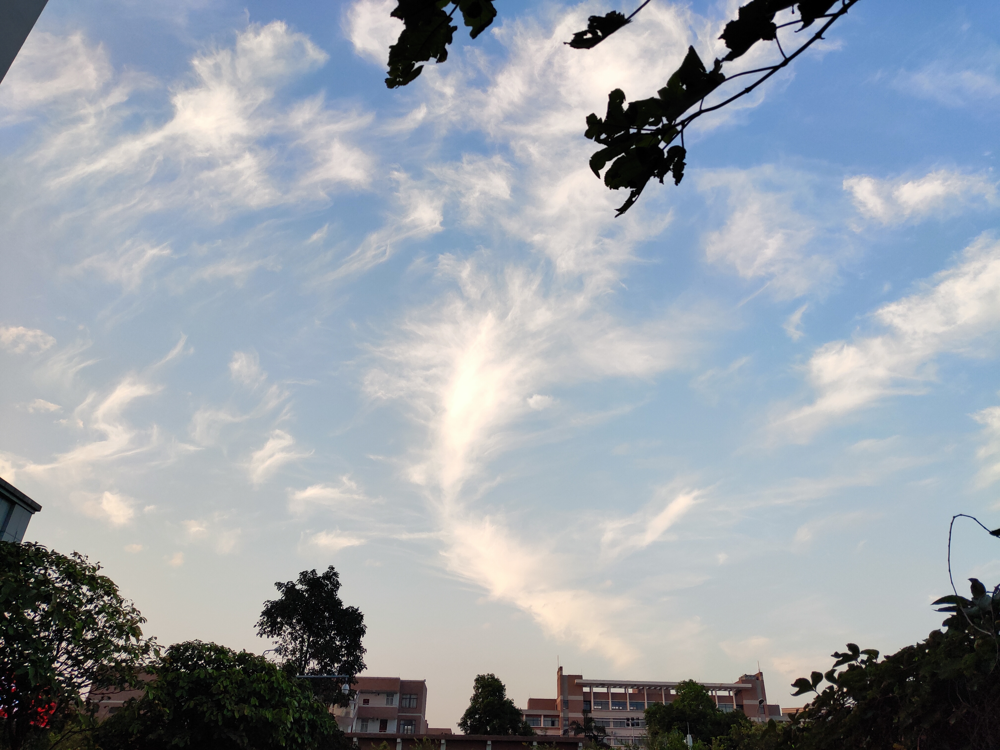</td>
    <td>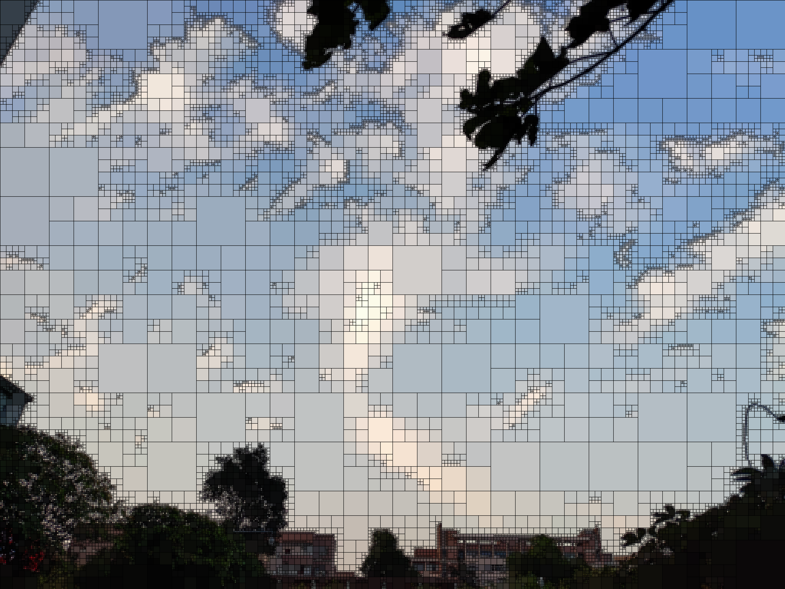</td>
    <td>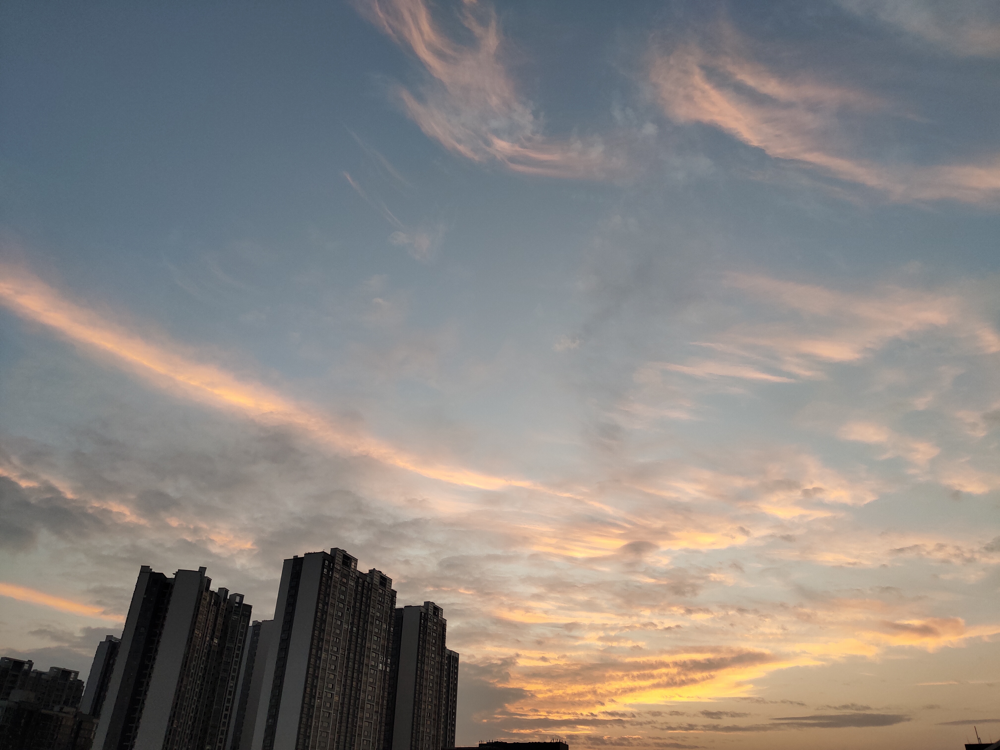</td>
    <td>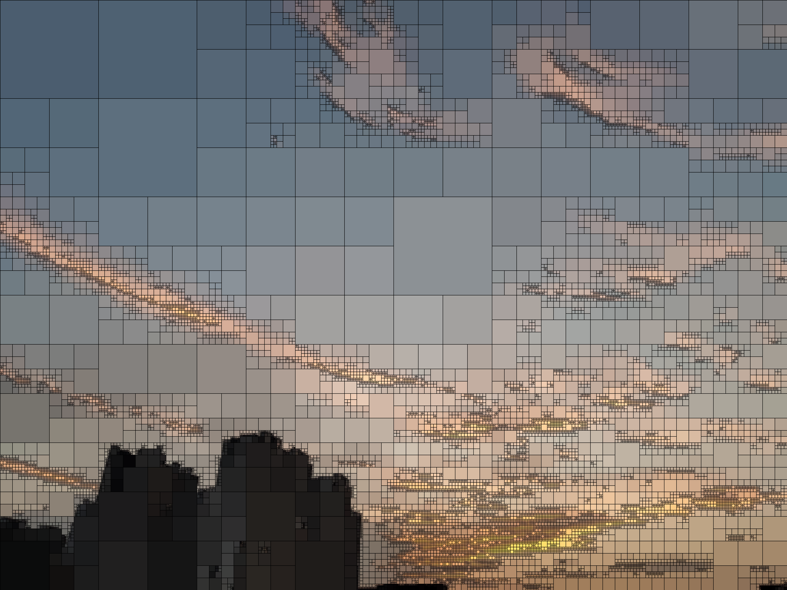</td>
</tr></table>

### Run `quadim ./img/18~9/ -o ./img/out-18~9/ --ratio 18:9 --depth 3 --stroke-width 30`:

<table style="table-layout:fixed;width:100%"><tr>
    <td>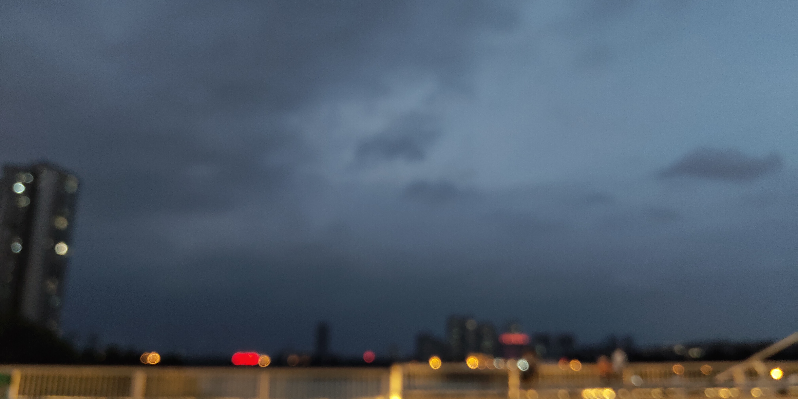</td>
    <td>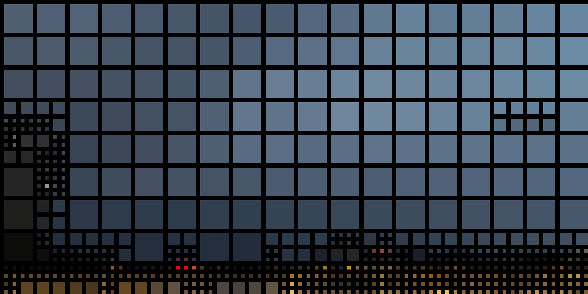</td>
    <td>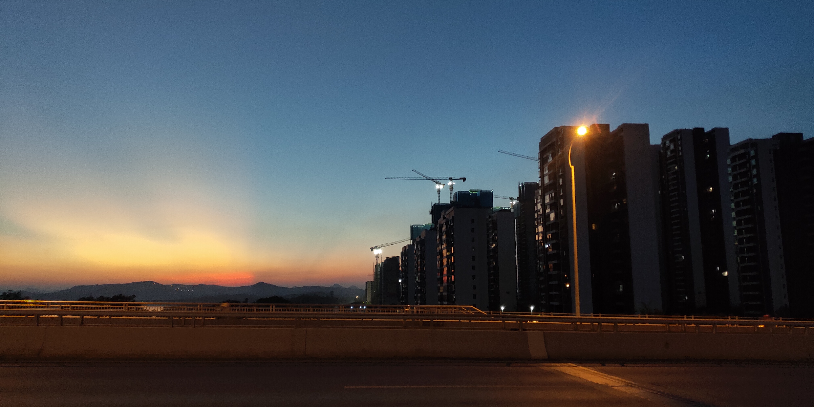</td>
    <td>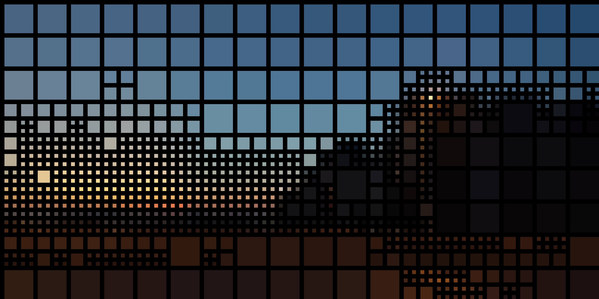</td>
</tr></table>

### Run `quadim ./img/3~4/ -o ./img/out-3~4/ --ratio 3:4 --depth 6 --shape circle --bg-color transparent`:

<table style="table-layout:fixed;width:100%"><tr>
    <td>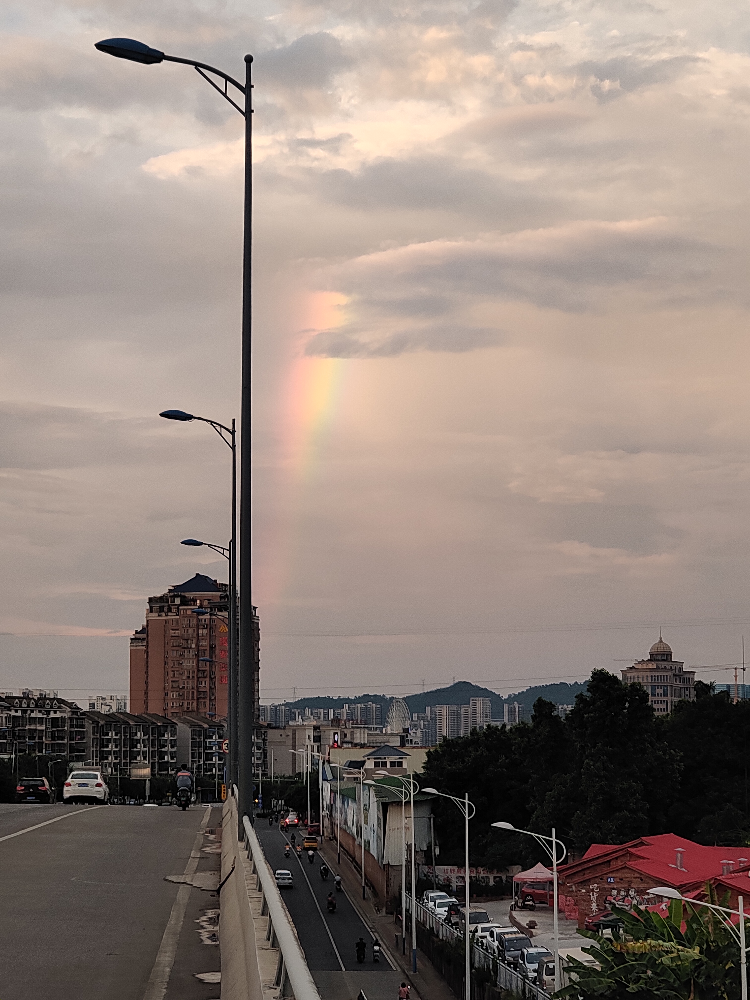</td>
    <td>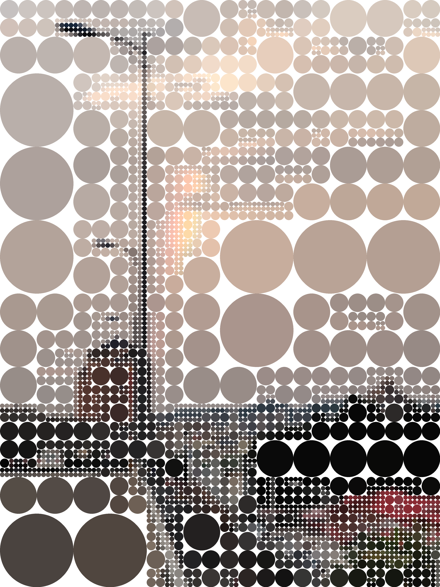</td>
    <td>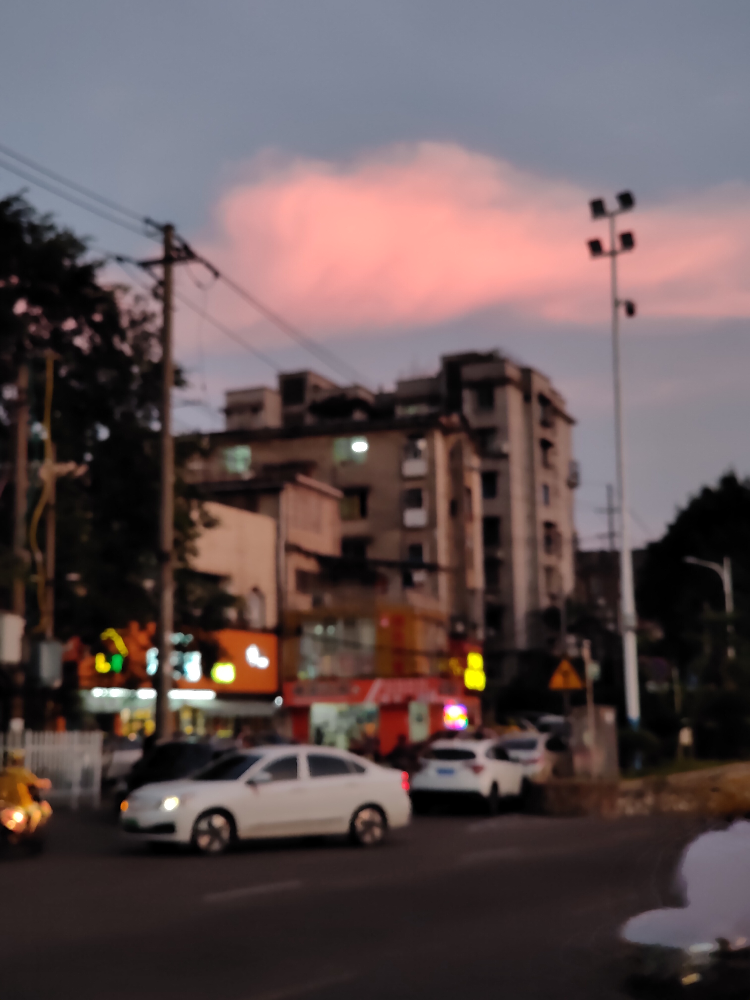</td>
    <td>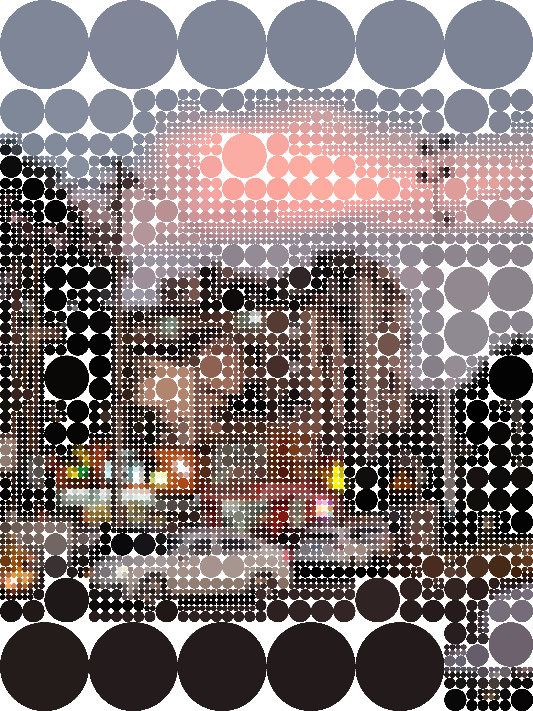</td>
</tr></table>

<sub>(I own the copyright of these photos, please don't abuse them（づ￣3￣）づ╭❤～)</sub>

## Use in my own projects?

Of course you can, all functions are packaged. A word of caution though, **no production stability guarantees**. *(Because I haven't learned how to guarantee it yet :P)*

In addition, the [documentation](https://docs.rs/quadim) is still being improved. Focus on `analyze()` and `render()`, that's the all you need to generate quad-images.

## Feature List

- Multithread! Fastest implementation to date
- Process images in RGBA-8 format.
- Merge tests in YCbCr instead of RGB space.
- Since there is no antialiasing, only the left and top borders are actually drawn when `--shape rect --border-width N` (N > 0) rendering parameters are provided. It is more noticeable when specifying a large `border_width` or an abrupt `border_color`.
- For color parameters: you can pass in `DarkSlateGray`, `hsla(168, 100%, 50%, 1)`, etc. all colors that can be written in CSS. *(Thanks to [csscolorparser](https://github.com/mazznoer/csscolorparser-rs))*

## Roadmap

- 🔥 Allows writing your own brush styles, such as a cross that rotates over time, spots of light that move to the rhythm of the music, filter the specified color in HSL, etc.
- Completely separate analysis and rendering, allowing direct access to the quadtree binary format...
- More friendly CLI: Allow multiple images to be passed in at a time, and automatically detect the most appropriate slicing ratio.

## How it works?

0. Use [clap](https://github.com/clap-rs/clap) to parse command line input; Use [src-dst-clarifier](https:github.com/eternal-io/src-dst-clarifier) to handle source-to-destination file mapping; Use [threadpool](https://github.com/rust-threadpool/rust-threadpool) to parallel processing.

1. Analyze Pass

    1. Divide the image into sub-slices according to `QuadimParams::slicing_ratio`. It is often necessary to choose a correct ratio to keep sub-blocks square, such as `-r 16:9`.

    2. For each sub-block, the quadtree is traversed depth-first according to `GenericParams::max_depth`. (Here is a line of code that limits the real maximum depth, so the side length of the sub-image is always greater than zero pixel)

    3. Attempts to merge all sub-blocks.

        There are two cases that can be merged:

        1. The maximum depth is reached, all pixels in this area will always merged, averaged and cached.
        2. Check the four pixels in the **upper left corner** of the four sub-blocks of itself, calculate their standard deviation or range (According to `AnalyzeParams::merge_method`) and compare with `AnalyzeParams::thres_`. Merge if "fluctuation" is small enough, then calculate the average and cache it.

        There are two cases that **cannot** be merged:

        3. The inverse of case two.
        4. Sub-blocks of sub-blocks of sub-blocks... cannot be made into merged.

    4. The additional data structure `[CanvasPixel]` caches "color average" and "should not merge".

        (The pixel color average is stored at the equivalent of the **upper left corner** of the sub-block, easily addressing by right shift. `[CanvasPixel]` is itself one-dimensional, but abstracted to be the same size as the image, two-dimension, which is why the number of pixels of the image cannot be larger than the length of the cache.)

    5. After the traversal complete, the quadtree information has been fully recorded in canvas. Since no data is double-counted, so Quadim is very efficient.

2. Render Pass

    This time it is the breadth-first traversal of the quadtree. Simply put, it is to take the "color" out of the quadtree and use the "brush" (trait `Brush`) to draw on the original image.

    Since the size of the new image is guaranteed to be the same as the original image, it can be operated in-place on the original image buffer, requiring no additional memory allocation, which is another element that keeps Quadim efficient.

## Known Issues

- When drawing a large ellipse/circle, it gets cropped. (See [image-rs/imageproc#519](https://github.com/image-rs/imageproc/issues/519))

## Appendix: Exit Code Meanings

0. Success.
1. Some errors.
2. Too many errors.
3. Fatal.
