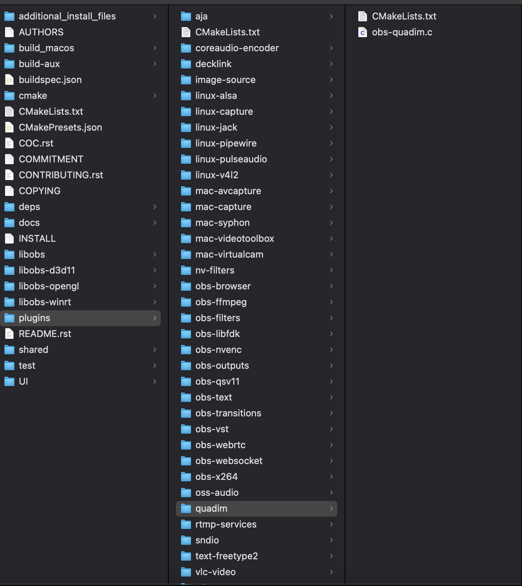
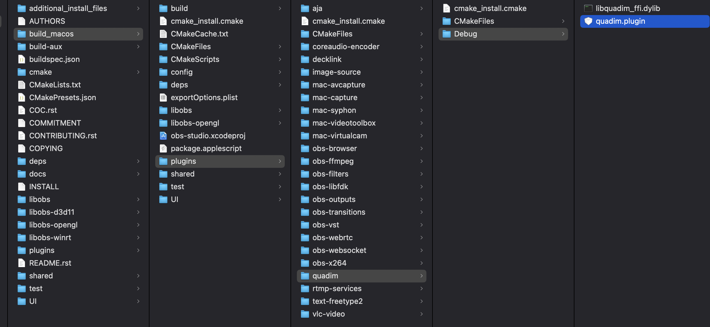
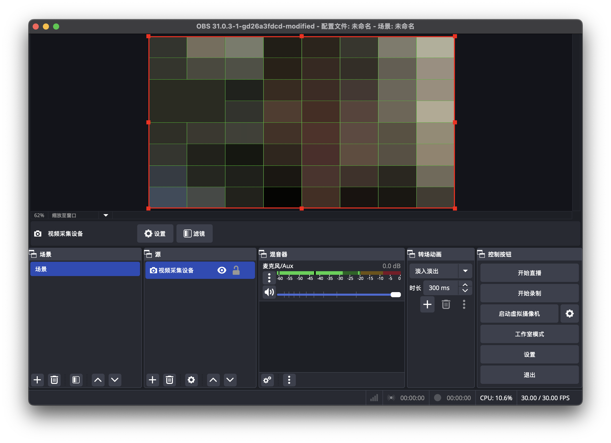

# obs-quadim 教程

由于暂时没有完成插件的一键部署，需要通过手动部署的方式将插件放到 obs 的目录下并完成配置。

1. 在`quadim-ffi`目录下运行`cargo build --release`

2. 将该文件夹复制到 obs-studio 的 plugins 目录下
    

3. 修改 plugins 目录下的 CMakeLists.txt，加入 obs-quadim 插件
    ```
    add_obs_plugin(quadim PLATFORMS WINDOWS MACOS LINUX)
    ```

4. 生成 CMake 工程

5. 将 1 中生成的动态链接库拷贝到 build/plugins/obs-quadim/Debug 目录下
    

6. 编译运行 OBS

7. 选择 quadim 滤镜，即可使用
    
